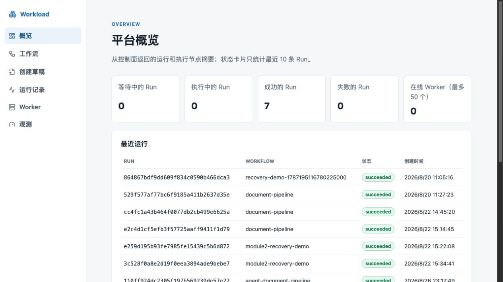

# AI Workload Platform

面向 Agent 与确定性程序任务的可靠运行时和调度平台。

> 当前可运行范围：模块 7 已增加 React/TypeScript/Vite 控制台，可完成自然语言草稿、服务端校验、人工确认、Workflow 创建、Run 启动和执行观测。默认使用 Mock Model/Executor；真实 Docker/Kubernetes 边界仍以模块 6 验证报告为准。



上图为脱敏的本地 Mock 演示界面；默认运行不需要真实模型服务。

## 要解决的问题

脚本、定时器和 Agent 原型可以快速完成一次任务，但当工作包含多个依赖步骤、运行时间较长并且可能失败时，通常还需要处理：

- 前后步骤的依赖和并发；
- 进程重启后的状态恢复；
- 临时失败、超时、取消和重复执行；
- 多个执行节点之间的任务分配；
- Agent 的模型、工具、权限、预算和人工审批；
- 日志、指标、调用链和执行审计。

本项目不替代任务自身的业务逻辑，而是统一管理普通程序和 Agent 的可靠执行过程。

## 核心方向

- **可靠工作流内核：** 使用 DAG（Directed Acyclic Graph，有向无环图）表达依赖，通过状态机管理任务、执行尝试、重试、取消和恢复。
- **普通程序与 Agent：** 二者共用可靠性语义，但保持不同的执行接口、权限和观测数据。
- **可验证的分布式执行：** 使用租约、心跳和故障实验解释节点失联与任务重新分配。
- **受限运行环境：** 逐步加入资源和网络限制，同时明确容器不是绝对安全沙箱。
- **证据优先：** 性能和可靠性结论必须来自自动化测试、可复现实验和原始数据。

## 架构概览

```text
CLI / SDK / 控制台
        |
        v
控制面 API
        |
        v
可靠工作流内核 <-> 持久化存储
        |
        v
Worker
  |-> Mock / 受限容器执行器 -> Docker Engine API 或 Kubernetes API
  `-> Agent Runtime -> 模型 / 工具 / 人工审批
```

Agent Runtime 是 Agent 的运行时环境，负责准备模型、工具、上下文、权限和预算，并记录模型调用、工具调用和人工审批等执行事件。

完整职责和数据流见[架构基线](docs/架构/架构基线.md)。

## 快速开始

环境要求：Go 1.26 或兼容版本；FileStore 的原子替换实现当前只支持 macOS 和 Linux。

不启动服务器即可运行模块 3 的离线 Mock 演示：

```bash
mkdir -p .workload/agent-demo
go run ./cmd/workload agent draft '先读取 article.md，再清洗内容，最后生成摘要' \
  --model mock --output .workload/agent-demo/draft.json
go run ./cmd/workload agent validate .workload/agent-demo/draft.json \
  --output .workload/agent-demo/validated.json
DRAFT_HASH="$(jq -r '.content_hash' .workload/agent-demo/validated.json)"
go run ./cmd/workload agent confirm .workload/agent-demo/validated.json \
  --hash "$DRAFT_HASH" --output .workload/agent-demo/workflow.json
```

`draft` 生成结构化建议，`validate` 检查任务目录、参数、权限、任务超时、Agent 并发与 DAG，`confirm` 验证草稿哈希后只输出最终 WorkflowDefinition，不会自动创建 Workflow 或启动 Run。CPU、内存和临时存储限制留到模块 6 的真实执行环境。完整演示和真实模型人工配置见[项目本地运行、演示与换电脑手册](docs/部署/本地开发与配置.md)。

运行全部自动化测试（真实 PostgreSQL 测试需要设置 `TEST_DATABASE_URL`）：

```bash
go test ./...
```

首次运行先创建本机配置文件，并按[本地开发与配置](docs/部署/本地开发与配置.md)第 7 节生成三个不同的本地 Token。`.env.local` 已被 Git 忽略，不会提交：

```bash
cp -n .env.example .env.local
```

启动 PostgreSQL、执行迁移并运行控制面。下面的 `source` 会把 `.env.local` 加载到当前终端；每个新终端都要单独加载一次：

```bash
set -a
source .env.local
set +a
docker compose up -d postgres
go run ./cmd/workload-server migrate up
go run ./cmd/workload-server
```

控制面启动后，在一个新终端中加载相同的本机配置并启动一个 Worker：

```bash
set -a
source .env.local
set +a
export WORKLOAD_SERVER_URL='http://127.0.0.1:8080'
export WORKLOAD_WORKER_NAME='worker-main'
go run ./cmd/workload-worker
```

Worker 会自行注册、按空闲槽位领取、心跳续租并提交 Mock 结果。第二个 Worker 只在多 Worker 专项验证时启动；模块 6 的 Docker/Kubernetes 执行器也属于专项路径。完整演示见[项目本地运行、演示与换电脑手册](docs/部署/本地开发与配置.md)。

Docker 登录不是本地公开 PostgreSQL 镜像的前置条件。新电脑环境准备、完整运行步骤和当前推荐演示见[项目本地运行、演示与换电脑手册](docs/部署/本地开发与配置.md)。该手册按仓库版本维护，README 只保留当前版本的最短启动入口。

启动浏览器控制台（需要先启动 PostgreSQL、控制面和至少一个 Worker）：

```bash
cd web
npm ci
npm run dev
```

打开终端输出的 Vite 地址（通常是 `http://127.0.0.1:5173/`），输入 operator Token。点击“创建草稿”，输入“先读取 article.md，再清洗内容，最后生成摘要”，依次校验、确认并启动运行。控制台通过 Vite 代理访问控制面，不保存 Token 到仓库或 URL；完整终端职责和换电脑步骤见[本地开发与配置](docs/部署/本地开发与配置.md)。

服务启动后，可以使用 viewer Token 读取低基数 Prometheus 指标。该接口不会返回 Run、Task、Worker 或 Dispatch ID 标签：

```bash
curl -fsS -H "Authorization: Bearer $WORKLOAD_VIEWER_TOKEN" \
  "$WORKLOAD_SERVER_URL/metrics"
```

执行三步骤文档处理本地示例：

```bash
go run ./cmd/workload local run examples/document-pipeline.json
```

命令输出包含每次随机生成的 RunID 和最终状态，例如：

```text
run_id=bc7076993d126572b9832e45247a557e status=succeeded
```

使用实际输出的 RunID 查询持久化状态：

```bash
go run ./cmd/workload local status bc7076993d126572b9832e45247a557e
```

默认数据目录是 `.workload/runs`，可以通过 `WORKLOAD_DATA_DIR` 覆盖：

```bash
WORKLOAD_DATA_DIR=/tmp/workload-runs go run ./cmd/workload local run examples/document-pipeline.json
```

`.workload/` 已加入 Git 忽略规则。示例使用 Mock Executor 返回确定成功结果，不会执行 Action 中的本机命令，也不会调用模型或外部服务。

控制面启动后，可在另一个终端加载本机配置，再通过 HTTP 控制面创建并启动同一工作流：

```bash
set -a
source .env.local
set +a
export WORKLOAD_TOKEN="$WORKLOAD_OPERATOR_TOKEN"
export WORKLOAD_SERVER_URL="${WORKLOAD_SERVER_URL:-http://127.0.0.1:8080}"
go run ./cmd/workload workflow create examples/document-pipeline.json --idempotency-key demo-workflow-v1
DEMO_SUFFIX="$(date +%Y%m%d%H%M%S)"
START_OUTPUT="$(go run ./cmd/workload run start document-pipeline --version 1 --idempotency-key "demo-run-$DEMO_SUFFIX")"
printf '%s\n' "$START_OUTPUT"
RUN_ID="$(printf '%s\n' "$START_OUTPUT" | sed -nE 's/.*"run_id":"([^"]+)".*/\1/p')"
go run ./cmd/workload run status "$RUN_ID"
```

首次运行时执行创建命令；如果 Workflow 已存在并返回 `409 workflow_exists`，跳过该行继续启动 Run。创建 Workflow 的幂等 Key 必须在同一 Workflow 的重复请求中保持一致，不要为了绕过冲突更换 Key；每次要启动新的 Run，再生成新的 Run 幂等 Key。

网络控制面不会在自身进程执行任务；至少一个 `workload-worker` 必须在线，Run 才能从 `ready` 进入分发和执行。Worker 只返回安全 Mock 结果，不解释或执行 `Action`。

## 当前实现边界

- `workload local` 的本地 FileStore 模式仍在当前终端前台运行；控制面 CLI 通过 `WORKLOAD_SERVER_URL` 和 `WORKLOAD_TOKEN` 调用 HTTP API，写操作必须显式提供 `--idempotency-key`。
- FileStore 使用“每个 Run 一个完整 JSON 快照”，适合模块 1 的单机验证，不支持多进程并发写入或复杂查询。
- 原子替换依赖同目录临时文件和 `os.Rename`，当前明确支持 macOS 和 Linux，不对其他平台作相同保证。
- 恢复语义是“至少执行一次”：崩溃发生在外部动作成功但成功状态保存之前时，任务可能再次执行。未来真实 Executor 必须使用幂等操作、唯一请求 ID 或结果去重控制重复副作用。
- 数据库连接或 Advisory Lock 运行期失效时，控制面会变为不可就绪并以错误退出，不在同一进程自动重新加锁。Worker 在无法续租时会在本地安全期限停止执行；新控制面进程启动后从 PostgreSQL 已提交状态恢复，这种基础设施中断不会被写成用户取消。
- Workflow、Version、Run、Task 和 Event 列表使用不透明键集游标；Run 可按 `workflow_id`、`status` 组合过滤，游标只能在原资源和原过滤条件下继续使用。
- 单个 WorkflowDefinition 最多包含 10,000 个任务；1,000 个 Run 是 Benchmark 输入规模，不是第 1,001 个 Run 的容量拒绝上限。
- 当前已有多 Worker 分布式 Mock 执行和固定 Action 的受限 Docker/Kubernetes 执行；不接受任意 Shell、镜像、宿主机路径或 Docker Socket。容器不是绝对安全沙箱，真实 Agent 任务执行和完整日志指标平台仍不在范围内。
- Worker 使用配置式引导 Token 注册，再使用会话 Token 调用领取、心跳、完成和 drain API；数据库只保存令牌摘要，查询 API 不返回凭据。
- 租约和隔离令牌能拒绝旧结果，但不能撤销已经发生的外部副作用；分布式路径仍是至少执行一次。
- 当前只有一个 Dispatch Coordinator；PostgreSQL Advisory Lock 会拒绝第二个协调者，不提供自动高可用切换。
- 单个 Run 的状态变化共享一条 revision，保证事件顺序和旧快照拒绝，但会串行化该 Run 的数据库提交；模块 4 基准不显示随 Worker 数线性扩展。
- 模块 3 的 Mock Model 只复现固定文档处理目标，不代表自然语言理解质量；HTTP 模型适配器必须人工配置并显式选择，默认测试和演示不会访问外部模型。
- Agent 只能调用注册的只读目录工具；草稿校验和确认不能授权 Shell、任意文件、任意 URL 或数据库写入。

首轮环境、输入、五轮原始数据和限制见[模块 1 性能基线](docs/实验/模块1性能基线.md)。这些数据不是生产性能承诺。

模块 2 的单任务 HTTP/PostgreSQL 查询与 Run 创建五轮数据见[模块 2 控制面性能基线](docs/实验/模块2性能基线.md)。该基线使用本机回环请求，不代表生产尾延迟或饱和吞吐。

模块 3 的 Mock 生成、目录查询、草稿校验和取消收敛五轮数据见[模块 3 验证与限制](docs/实验/模块3验证与限制.md)。该数据只衡量平台本地开销，不包含真实模型网络延迟。

模块 4 的多 Worker、进程崩溃、迟到结果、控制面重启和 1,000 任务基准见[模块 4 验证报告](docs/实验/模块4验证报告.md)。该数据描述单机 PostgreSQL 和单 Run 的当前实现，不代表生产容量。

模块 5 的八类故障、五类告警和 24 组观测对照见[模块 5 验证报告](docs/实验/模块5验证报告.md)。该基准使用本机回环网络、Mock Executor 和 stdout Trace 的本地批处理路径，不代表生产观测后端或 SLA。

## 项目路线

项目共分为模块 0 至模块 7：

0. 项目定义与文档基线，已完成；
1. 单机可靠工作流内核，已完成；
2. 控制面 API 与持久化存储，已完成；
3. Agent Runtime、模型与工具执行，已完成；
4. 多 Worker、租约、心跳与故障恢复，已完成；
5. 可观测性、故障注入与性能验证，已完成工程实现、八类故障、五类告警和 24 组五轮性能对照；
6. 受限执行环境与 Kubernetes，已完成执行器、固定动作镜像、清单、Docker 和 kind/client-go 真实验证；
7. 真实场景、最小控制台与开源发布，当前交付已完成。

各模块为什么按此顺序推进、上一模块留下什么问题、下一模块使用哪些技术解决，见[项目路线图](docs/计划/项目路线图.md)中的“模块递进关系”。当前各模块的执行边界和模块 7收尾范围以项目路线图、验证报告和[本地开发与配置](docs/部署/本地开发与配置.md)为准。

## 当前可阅读内容

- [产品说明](docs/产品/产品说明.md)：目标用户、适用边界、现有产品和待验证差异。
- [架构基线](docs/架构/架构基线.md)：组件职责、数据流和模块演进。
- [项目范围决策](docs/决策/ADR-0001-项目范围.md)：为什么选择可靠工作流方向。
- [路线调整决策](docs/决策/ADR-0002-产品定位与模块路线调整.md)：为什么收窄定位并重排模块。
- [学习资料规范](docs/学习/学习资料规范.md)：技术文章的知识深度、证据和发布要求。
- [模块 0 项目总览](docs/学习/文章/模块0-项目总览.md)：项目为什么存在、准备构建什么。
- [工作流基础文章](docs/学习/文章/模块0-工作流-DAG-状态机与可靠执行基础.md)：工作流、DAG、状态机与可靠执行基础。
- [模块 1 学习文章](docs/学习/文章/模块1-单机可靠工作流内核设计与验证基础.md)：单机内核的数据结构、调度语义和验证方法。
- [模块 2 学习文章](docs/学习/文章/模块2-从单机工作流内核到可靠控制面.md)：HTTP 控制面、PostgreSQL 事务、幂等、运行监督和崩溃恢复。
- [模块 2 验证报告](docs/实验/模块2验证报告.md)：自动化结果、人工演示状态和当前证据边界。
- [模块 3 学习文章](docs/学习/文章/模块3-Agent运行时模型工具与自然语言工作流.md)：Agent Runtime、模型适配、工具权限、草稿校验和人工确认。
- [模块 3 验证与限制](docs/实验/模块3验证与限制.md)：自动化测试、CLI 演示、性能基线和真实模型边界。
- [模块 4 需求与设计](docs/计划/模块4需求与设计.md)：为什么从单进程进入多 Worker，以及租约、心跳、迟到结果和重复执行边界。
- [模块 4 学习文章](docs/学习/文章/模块4-多Worker租约心跳与故障恢复.md)：Worker、Dispatch、租约、心跳、隔离令牌、事务与故障恢复。
- [模块 4 验证报告](docs/实验/模块4验证报告.md)：真实 PostgreSQL、多进程故障测试、性能数据和限制。
- [模块 5 需求与设计](docs/计划/模块5需求与设计.md)：观测旁路、低基数、Trace 边界、告警状态机和故障实验设计。
- [模块 5 学习文章](docs/学习/文章/模块5-可观测性故障注入与性能验证.md)：结构化日志、Prometheus 指标、OpenTelemetry、告警、故障注入和性能口径。
- [模块 5 验证报告](docs/实验/模块5验证报告.md)：八类故障、五类告警、24 组五轮基准和真实证据边界。
- [模块 6 学习文章](docs/学习/文章/模块6-受限执行环境与Kubernetes.md)：固定 Action、Docker/Kubernetes 执行、安全边界、资源限制和本地验证。
- [模块 6 验证报告](docs/实验/模块6验证报告.md)：Docker、kind/client-go 真实执行证据、静态清单和剩余实验边界。
- [模块 7 学习文章](docs/学习/文章/模块7-真实场景最小控制台与开源发布.md)：浏览器控制台、Draft API、Token 会话、轮询、CI/CD 和开源治理。
- [模块 7 验证报告](docs/实验/模块7验证报告.md)：浏览器闭环、自动化验证和明确限制。
- [模块 1 性能基线](docs/实验/模块1性能基线.md)：10,000 任务、1,000 Run、恢复和 FileStore 的原始 Benchmark 数据。

当前代码入口和限制见上方“快速开始”和“当前实现边界”。

## 安全与使用边界

本仓库已公开，包含许可证、贡献指南、安全策略、行为准则、变更日志和持续集成检查。欢迎基于这些规则阅读、运行和贡献。

仓库不得包含当前或过往公司的源代码、配置、业务数据、内部文档、密钥或其他保密信息。`.env.local`、容器卷、Token、模型 API Key、运行日志和截图中的敏感信息只保留在本地环境。路线图中的能力、性能和产品优势在获得可复现实验前属于计划或待验证假设。

默认演示使用 Mock Model 和 Mock Executor。真实模型兼容性、生产容量、完整 Kubernetes 网络隔离、CPU/临时存储限制和完整 Worker 租约恢复不应被推断为已验证能力；详见对应验证报告。

维护者可从[项目状态](项目状态.md)了解当前交付与验证边界，并按[维护者启动指南](docs/新窗口启动协议.md)恢复本地开发环境。
