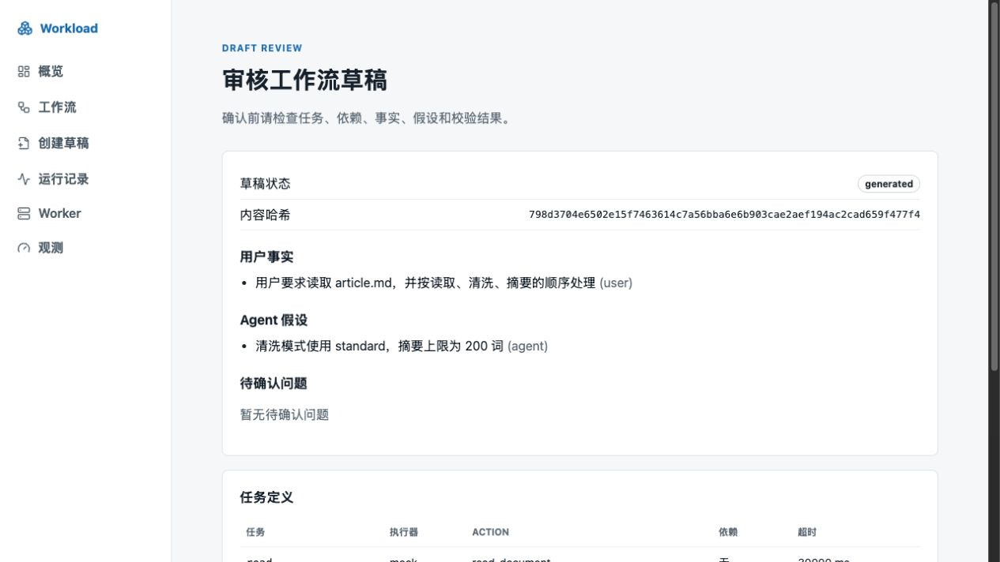
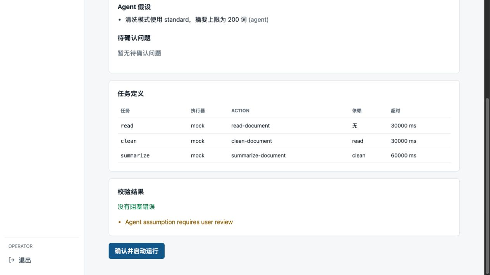
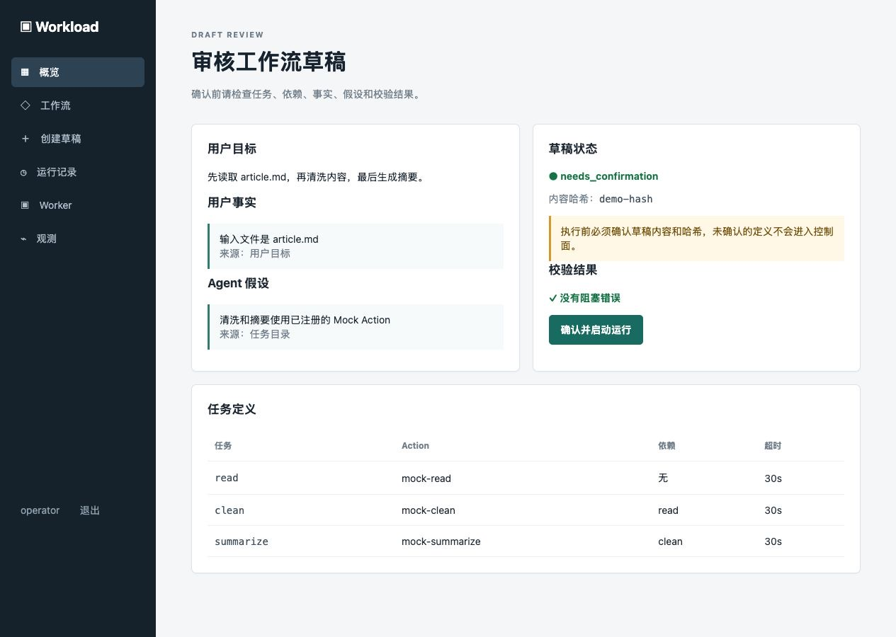
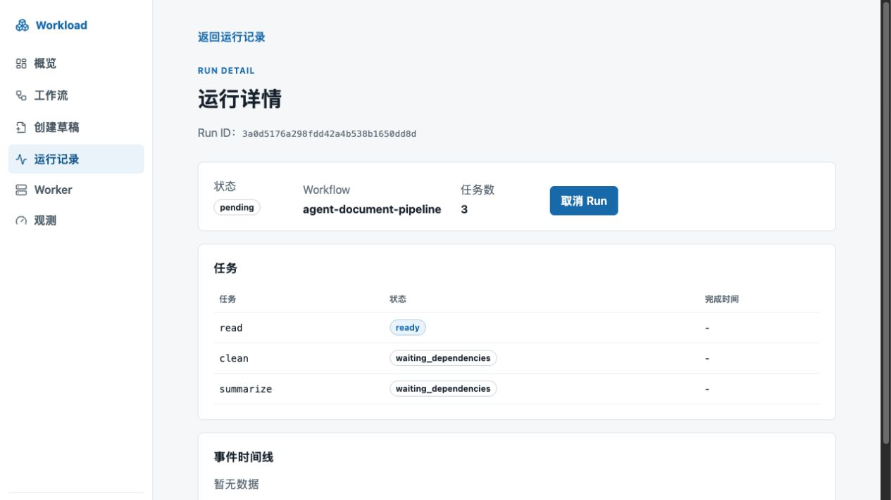
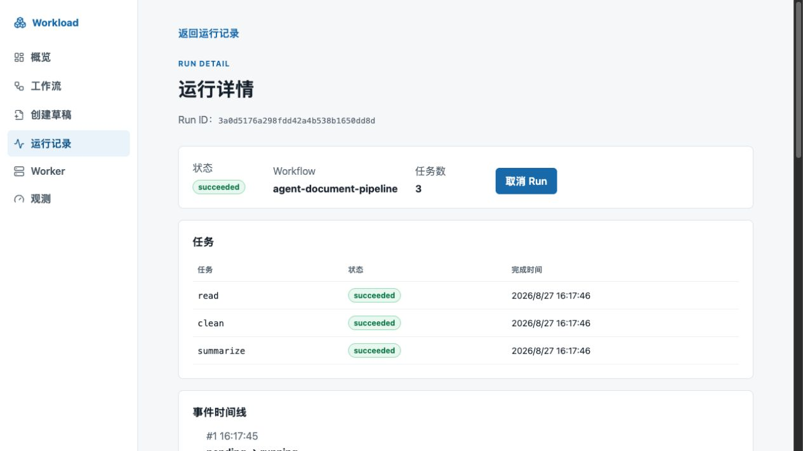
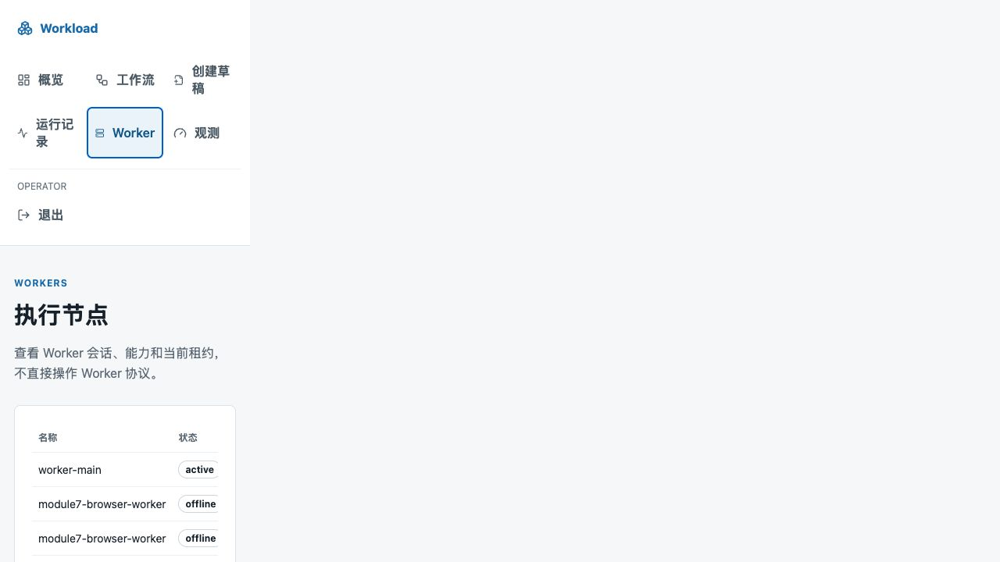
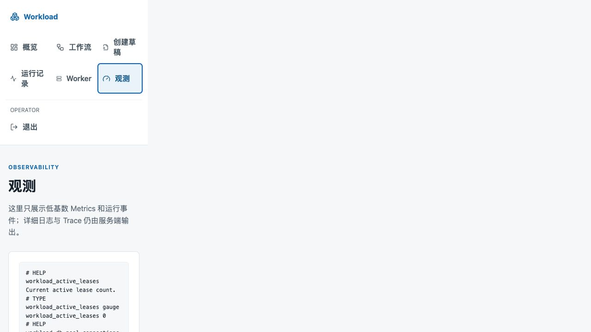

# 从 0 构建 AI Workload Platform（九）：真实场景、最小控制台与开源发布

## 从技术能力到可使用产品

AI Workload Platform 的前六个模块已经完成了工作流内核、可靠控制面、Agent Runtime、独立 Worker、可观测性和受限执行器。此时系统可以通过 CLI、JSON 和 HTTP API 工作，但新用户仍然需要记住很多命令，也看不到一条连续的产品流程。HTTP API 是通过 HTTP 请求访问服务能力的接口；PostgreSQL 是保存这些业务状态的关系型数据库。

模块 7要解决的不是新的调度算法，而是“如何让一个没有读过源码的人完成一次受控的工作流运行”：输入自然语言目标，查看 Agent 生成的草稿，确认后创建不可变 Workflow，启动 Run，在浏览器中观察 Task/Event、处理错误和取消，并按需通过 API 查询 Attempt 详情。

本文中的“真实场景”指真实可操作的产品使用流程，不代表模型已经接入真实供应商。默认演示使用离线 Mock Model 和 Mock Executor；真实模型兼容性本次不做外部调用，只说明代码支持的协议边界。

## 1. 为什么模块 7此时出现

模块 6已经证明任务可以进入 Docker 或 Kubernetes 的受限环境，但验证入口仍然偏向开发者：需要启动多个终端、手工准备 JSON、复制 Run ID，再用 curl 查询状态。这样的入口适合调试，不适合作为产品演示，也不能充分体现前后端整合能力。

因此模块 7增加一个轻量 Web 控制台，并保持三个边界：

1. Go 控制面和 PostgreSQL 仍是 Workflow、Run、Task、Attempt、Event 和 Worker 状态的唯一事实源；
2. 浏览器不连接 PostgreSQL、Docker Engine 或 Kubernetes API，不复制 DAG、重试、取消、租约和恢复逻辑；
3. Agent 草稿必须经过服务端校验、内容哈希确认和 operator（操作员）授权，模型输出不能直接执行。

这说明模块 7不是“把所有功能搬到前端”，而是给已有可靠能力增加一个可操作入口。

## 2. 一次完整的用户流程

假设用户输入：

> 先读取 article.md，再清洗内容，最后生成摘要。

控制台按下面的顺序工作：

| 步骤 | 用户动作 | 服务端动作 | 是否产生业务事实 |
| --- | --- | --- | --- |
| 1 | 输入自然语言目标 | 调用 Agent Runtime 生成 `WorkflowDraft` | 否，草稿只在请求和浏览器会话中存在 |
| 2 | 查看任务、事实、假设和问题 | 展示结构化草稿 | 否 |
| 3 | 点击校验 | 检查 Action、Input、依赖、超时、权限和 DAG | 否 |
| 4 | 确认内容和哈希 | 重新计算哈希，确认草稿未被替换 | 否 |
| 5 | 点击创建并运行 | 通过已有 Workflow API 创建不可变版本，再启动 Run | 是，写入 PostgreSQL |
| 6 | 查看详情 | 查询 Run、Task、Attempt 和 Event | 只读 |
| 7 | 点击取消或等待完成 | 调用控制面取消接口，或继续轮询终态 | 是，状态由控制面决定 |

Draft（草稿）是“尚未成为正式 Workflow 的中间对象”。它可以包含用户事实、Agent 假设、待回答问题和校验结果；只有确认后的 `WorkflowDefinition` 才能进入模块 2的控制面。


图 1：脱敏的本地 Mock 演示总览。页面将运行摘要、在线 Worker 和观测入口放在同一个工作区，数据均来自控制面 API。

进入“创建草稿”页面后，先输入自然语言目标。此时页面只收集目标，不会创建 Workflow 或启动 Run。



图 2：创建草稿页。自然语言目标会发送给 Draft API，由服务端生成待审核的结构化草稿。

点击“生成草稿”和“校验草稿”后，页面会展示任务、依赖、事实、假设、待确认问题和校验结果。校验通过仍然只是允许进入确认阶段。



图 3：草稿校验页。绿色校验结果表示草稿满足当前规则，不表示任务已经执行。

## 3. Draft API：为什么需要服务端审核

控制台新增三条版本化 HTTP API：

- `POST /api/v1/agent/drafts`：根据 `goal` 生成草稿；
- `POST /api/v1/agent/drafts/{draft-id}/validate`：重新校验草稿；
- `POST /api/v1/agent/drafts/{draft-id}/confirm`：提交草稿和原始 `content_hash`，确认后返回最终工作流定义。

一个生成请求的最小形式是：

```json
{
  "goal": "先读取 article.md，再清洗内容，最后生成摘要"
}
```

返回的草稿包含 `definition`、`facts`、`assumptions`、`questions`、`validation` 和 `content_hash`。前端可以展示这些字段，但不能自行把它们拼接成数据库记录。

确认时服务端会检查三件事：路径中的 Draft ID 与 Body 中的 ID 一致；草稿当前状态允许确认；重新计算出的哈希与用户看到的哈希一致。浏览器修改任务、依赖、事实或假设后，即使 JSON 仍然合法，也会因为哈希不一致被拒绝。

确认成功只代表得到一个可提交的 `WorkflowDefinition`，不代表 Workflow 已经写入数据库。控制台随后使用新的幂等 Key 调用已有 Workflow 创建接口，再使用另一个幂等 Key 启动 Run。这样 Draft 审核和控制面持久化可以分别测试。

## 4. 前后端边界

控制台只调用公开的控制面 API：

```text
浏览器
  -> Draft API：生成、校验、确认
  -> Workflow API：创建不可变版本
  -> Run API：启动、查询、取消
  -> Worker/Observability 查询 API：展示状态和指标

控制面
  -> Agent Runtime 和 Model Adapter
  -> PostgreSQL
  -> Worker、Docker 或 Kubernetes
```

浏览器不直接调用 Worker 的注册、领取、心跳、完成或 drain 接口。Worker 协议属于内部执行边界，前端绕过控制面会破坏租约、权限和状态审计。

## 5. 为什么选择 React、TypeScript 和 Vite

React 是按组件组织用户界面的 JavaScript 库。页面可以拆成导航、表格、状态徽章、草稿审核和运行详情等组件，局部状态变化不会要求重新加载整个页面。

TypeScript 是带静态类型的 JavaScript。它可以在构建阶段发现 API 字段拼写错误、状态枚举不一致和组件属性缺失。对这个项目来说，前端要展示的状态很多，静态类型比完全依赖运行时观察更容易维护。

Vite 是前端开发服务器和构建工具，提供快速热更新和生产构建。开发环境通过代理把 `/api`、`/health` 和 `/metrics` 转发到 Go 控制面，因此浏览器不需要额外配置跨域。

没有选择 Next.js，是因为当前不需要服务端渲染、后端路由或全栈部署；没有引入大型状态管理库，是因为页面共享状态只有会话、当前 Draft 和当前 Run，组件状态与 `sessionStorage` 已足够。代价是以后如果页面数量、缓存关系或离线编辑显著增加，需要重新评估路由和状态管理方案。

控制台是 SPA（Single-Page Application，单页应用）：浏览器首次加载 HTML 和 JavaScript，之后通过 API 更新数据，不为每个页面重新请求一份 HTML。当前导航使用页面状态切换，业务数据仍然来自控制面。

## 6. 会话、角色和 Token

Bearer Token 是放在 HTTP `Authorization` 头中的访问凭证。登录页让用户输入控制面地址、角色和 Token，前端只把它们保存到当前标签页的 `sessionStorage`：

- 刷新当前标签页后可以恢复会话；
- 关闭标签页后会清除 Token 和未提交草稿；
- Token 不写入 URL、仓库、日志或数据库；
- 在新的本地环境中必须重新创建 `.env.local` 并生成新的本地 Token。

viewer 角色只能查询；operator 才能生成、校验、确认草稿、创建 Workflow、启动和取消 Run。前端会隐藏不适用的操作，但真正的权限判断仍由服务端完成，因此不能把按钮隐藏当成安全机制。

控制台不保存模型 API Key。真实模型配置留在控制面进程的环境变量中，浏览器只携带平台 Token。这样模型供应商凭证不会随页面请求进入客户端。

## 7. 页面和状态设计

### 7.1 草稿页面

Create 页面只收集自然语言目标并调用 Draft API。Draft Review 页面展示：

- 用户事实和 Agent 假设；
- 未解决问题和校验警告；
- 每个任务的 key、Action、依赖和超时；Input 与重试策略仍保存在 Draft JSON 和 API 响应中，当前轻量表格没有逐项展开；
- 当前 Draft 状态和内容哈希。

存在校验错误或未解决问题时，确认按钮不可用。服务端返回 `draft_changed` 时，页面要求重新校验，而不是自动覆盖用户看到的草稿。



图 4：脱敏的本地 Mock 演示草稿确认页。用户可以在执行前查看事实、假设、任务依赖和校验结果。

点击“确认并启动运行”后，控制台会先确认 Draft，再创建不可变 Workflow 版本并启动 Run。运行记录页会先显示新 Run 的状态和任务进度。



图 5：Run 创建后的运行记录页。此时请求已经被控制面接受，任务是否完成仍以服务端状态为准。

### 7.2 Run 详情页

Run Detail 页面查询 Run 摘要、Task 列表和 Event 时间线，并提供运行中的取消按钮。Attempt 记录可通过控制面 Task 详情 API 查询；当前轻量页面没有把每条 Attempt 历史逐项展开。Run 进入 `succeeded`、`failed`、`canceled` 或其他终态后停止轮询。

Task 和 Attempt 的状态由控制面返回，前端不根据“请求已经发出”自行显示成功。没有 Worker 时，Run 可以停留在 `ready` 或 `queued`，这属于真实系统状态，页面不能伪造进度。



图 6：脱敏的本地 Mock 演示 Run/Task 详情页。状态、任务和事件时间线由控制面返回，终态后停止轮询。

### 7.3 Workers 和 Observability

Workers 页面展示 Worker 会话、能力、并发和活动租约；Observability 页面展示低基数 Prometheus 指标摘要和原文入口。两页只读查询，不执行 Worker 生命周期操作。



图 7：Worker 状态页。`active` 表示 Worker 会话仍在心跳，`mock` 表示当前演示使用模拟执行器，并发和活动租约用于判断是否有执行槽位被占用。



图 8：观测指标页。页面展示控制面导出的低基数 Metrics 原文，用于快速检查数据库连接、HTTP 请求和租约等运行信号。

## 8. 轮询和错误处理

轮询是客户端按固定间隔重复发送查询请求。当前选择轮询而不是 WebSocket 或 SSE（Server-Sent Events，服务器推送事件），原因是本项目的数据量和实时性要求有限，固定请求更容易部署、测试和排查。未来如果事件数量增加或延迟要求提高，可以在已有 Event 模型之上评估推送。

每次查询使用 `AbortController` 传递取消信号，离开页面或切换 Run 时取消旧请求，避免旧数据覆盖新页面。服务端返回终态后，Hook 不再创建新的定时器。

需要明确区分几类失败：

| 状态 | 页面行为 |
| --- | --- |
| 401 | 提示 Token 无效，保留 API 地址和用户输入 |
| 403 | 说明当前角色没有该操作权限 |
| 404 | 说明资源不存在或 Run ID 已失效 |
| 409 | 展示草稿哈希、Workflow 冲突或幂等冲突，不自动重复写请求 |
| 503 | 展示控制面未就绪，等待用户检查服务和数据库 |
| 网络中断 | 保留当前输入，不重放结果不明确的写请求 |

写请求不自动重试。因为创建 Workflow 或启动 Run 的请求可能已经在服务端提交成功，盲目重试会产生重复版本或语义不清的结果；用户可以根据返回的幂等 Key 和资源查询结果决定下一步。

## 9. 测试分层

前端测试使用 Vitest、React Testing Library 和 JSDOM（模拟浏览器 DOM 的测试环境），覆盖：

- Token 保存、恢复、退出清除和角色边界；
- Bearer Header、JSON Header、幂等 Header 和统一错误信封；
- 草稿生成、校验、哈希确认和篡改错误；
- Workflow 创建、Run 启动、轮询、取消、完成和失败；
- Task、Event、Worker 和 Metrics 的加载、空状态和错误状态；Attempt 详情由后端 API 和独立查询测试覆盖；
- `npm run typecheck` 和 `npm run build`。

后端继续运行 Draft API、OpenAPI、Agent Runtime 和控制面测试。浏览器人工验收则验证一条完整闭环：生成 Draft，查看事实和假设，确认并创建 Workflow，启动 Run，看到 Task 和 Event，按需通过 API 查询 Attempt，最后刷新页面确认状态来自 API 而不是前端内存。

模块 7当前本地闭环使用 PostgreSQL、Mock Model 和 Mock Executor，实际观察到三个任务成功。这个结果证明的是控制台和 API 集成，不证明真实模型的规划质量、Kubernetes 网络隔离或生产容量。

## 10. 本地运行与复现

本节只保留理解项目所需的最短运行流程。完整的终端职责、Docker Desktop、PostgreSQL、迁移、控制面、Worker、Vite、Token、环境准备和故障排查步骤收录在项目仓库的 `docs/部署/本地开发与配置.md`，可从下文的 GitHub 仓库首页进入。最短流程是：

1. 安装 Go、Node.js 24 LTS、npm、Docker Desktop 和 `jq`；
2. 克隆仓库，复制 `.env.example` 为 `.env.local`，重新生成三个不同的本地 Token；
3. 启动 PostgreSQL，执行迁移，启动控制面和至少一个 Worker；
4. 在 `web/` 执行 `npm ci` 和 `npm run dev`；
5. 浏览器输入 operator Token，按本文第 2节的目标完成闭环。

Git 仓库只保存代码、迁移、Compose 配置、环境变量模板和示例。Docker 镜像缓存、容器、数据库卷、`.env.local`、Token、密码和日志属于本地环境，需要在运行项目的环境中单独准备。

项目源码、完整运行手册和每个模块的验证证据会随开源仓库持续更新：[AI Workload Platform GitHub 仓库](https://github.com/fhtyfgty5-eng/ai-workload-platform)。读者可以先阅读仓库首页，再按照部署手册启动本地环境；需要注意，默认演示使用 Mock Model，不要求购买模型服务。

## 11. 开源发布和 CI

CI（Continuous Integration，持续集成）是在每次提交时自动运行格式化、测试和构建。CD（Continuous Delivery/Deployment，持续交付/部署）是把通过验证的产物交给发布流程；本项目当前只建立 CI 门禁，不自动部署生产环境。

GitHub Actions 会运行 Go 测试、竞态检测、`go vet`、文档检查、Kubernetes 清单检查，以及前端 `npm ci`、测试、类型检查和构建。依赖版本由 `go.mod`、`go.sum` 和 npm lockfile 固定；CI 不访问真实模型、本机数据库或付费服务。

开源治理文件各有职责：

- `LICENSE` 说明代码授权条件；
- `CONTRIBUTING.md` 说明如何提交问题和变更；
- `SECURITY.md` 说明如何报告安全问题；
- `CODE_OF_CONDUCT.md` 说明协作行为边界；
- `CHANGELOG.md` 记录公开版本变化；
- `scripts/check-secrets.sh` 和依赖许可证检查降低误公开风险。

这些文件不能替代安全审查。容器执行器仍有明确的输入、镜像、网络和权限边界，不能宣传为绝对安全沙箱。

## 12. 真实模型协议边界（本次不执行）

项目已经有 OpenAI-compatible HTTP Model Adapter，但默认关闭真实模型。本次不执行外部模型调用，也不要求读者准备 API Key。适配器代码可以发送 `model`、`messages`、工具定义和 JSON Schema `response_format`，并处理工具调用后的下一轮消息；这只是协议实现，不代表已经验证过某个供应商。

模块 3 的自动化测试使用本机 HTTP 模拟服务，验证请求格式、工具调用消息、结构化输出、429、非法响应和取消。未来如果需要验证具体供应商，应单独记录供应商、模型、响应质量、错误边界和费用，并确保凭证只存在本机配置中，不能把未执行的兼容性实验写成项目已有能力。

## 13. 结论和限制

模块 7完成后，项目拥有一条可演示的产品闭环：自然语言目标进入 Draft，服务端校验和哈希确认阻止未审核定义执行，控制面创建不可变 Workflow 并启动 Run，浏览器展示 Task、Event、Worker 和 Metrics；Attempt 详情仍可通过控制面 API 查询。

已经验证的是本地 PostgreSQL、Mock Model、Mock Executor、前端自动化测试、类型检查和生产构建。尚未验证的是某个真实模型供应商的规划质量、所有 OpenAI-compatible 接口的兼容性、生产容量和完整的 Kubernetes 安全隔离。

控制台的价值是降低使用和演示门槛，不是替代后端可靠性。即使浏览器关闭，Workflow、Run、Task 和 Attempt 仍由控制面和 PostgreSQL 保存；浏览器重新打开后可以重新查询服务端状态，但未提交的 Draft 不会自动恢复。

## 14. 参考资料

- [React 文档](https://react.dev/)
- [TypeScript 文档](https://www.typescriptlang.org/docs/)
- [Vite 文档](https://vite.dev/guide/)
- [Vitest 文档](https://vitest.dev/guide/)
- [React Testing Library](https://testing-library.com/docs/react-testing-library/intro/)
- [GitHub Actions 文档](https://docs.github.com/actions)

## 项目源码

本文对应模块 7。完整源码、部署手册、验证报告和其他学习文章见 [AI Workload Platform GitHub 仓库](https://github.com/fhtyfgty5-eng/ai-workload-platform)。
